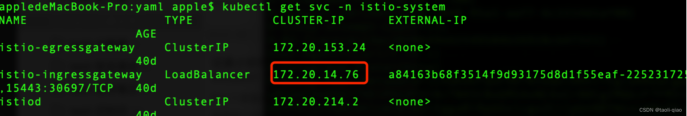
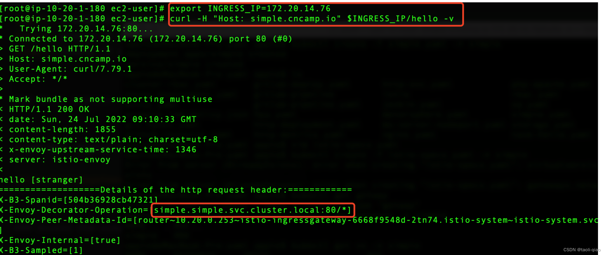

* https://blog.csdn.net/qiaotl/article/details/125972398

## 案例一

部署后端服务 simple，配置 istio 的 VirtualService 和 Gateway，gateway 网关添加在 istio-ingress pod 上，gateway 网关 expose 出 80 端口。
VirtualService 将 simple 网关、80 端口发送的，且请求的 hosts 是 simple.cncamp.io 的请求路由到后端务 simple.simple.svc.cluster.local 上。

```yaml
apiVersion: apps/v1
kind: Deployment
metadata:
  name: simple
spec:
  replicas: 1
  selector:
    matchLabels:
      app: simple
  template:
    metadata:
      annotations:
        prometheus.io/scrape: "true"
        prometheus.io/port: "80"
      labels:
        app: simple
    spec:
      containers:
      - name: simple
        imagePullPolicy: Always
        image: cncamp/httpserver:v1.0-metrics
        ports:
        - containerPort: 80
---
apiVersion: v1
kind: Service
metadata:
  name: simple
spec:
  ports:
    - name: http
      port: 80
      protocol: TCP
      targetPort: 80
  selector:
    app: simple
```

```yaml
apiVersion: networking.istio.io/v1beta1
kind: Gateway
metadata:
  name: simple
spec:
  selector:
    istio: ingressgateway
  servers:
  - hosts:
    - simple.cncamp.io
    port:
      name: http-simple
      number: 80
      protocol: HTTP
---
apiVersion: networking.istio.io/v1beta1
kind: VirtualService
metadata:
  name: simple
spec:
  gateways:
  - simple
  hosts:
  - simple.cncamp.io
  http:
  - match:
    - port: 80
    route:
    - destination:
      host: simple.simple.svc.cluster.local
      port:
        number: 80
```

查看 istio-ingress 的 service 的 IP 地址，通过 istio-ingress 的 IP 地址发送请求。


可以看到请求返回了响应，说明整个路由转发成功发送到了后端服务。


## 案例二

再部署一个服务 nginx，配置 VirtualService 根据不同 URL 转发到不同的后端服务的路有规则，VirtulaService 中还设置了 rewrite 字段。Gateway 与上面相同，还是 expose 出 80 端口即可。

```yaml
apiVersion: apps/v1
kind: Deployment
metadata:
  name: nginx-deployment
spec:
  replicas: 1
  selector:
    matchLabels:
      app: nginx
  template:
    metadata:
      labels:
        app: nginx
    spec:
      containers:
        - name: nginx
          image: nginx
---
apiVersion: v1
kind: Service
metadata:
  name: nginx
spec:
  ports:
    - name: http
      port: 80
      protocol: TCP
      targetPort: 80
  selector:
    app: nginx
```

```yaml
apiVersion: networking.istio.io/v1beta1
kind: Gateway
metadata:
  name: simple
spec:
  selector:
    istio: ingressgateway
  servers:
  - hosts:
    - simple.cncamp.io
    port:
      name: http-simple
      number: 80
      protocol: HTTP
---
apiVersion: networking.istio.io/v1beta1
kind: VirtualService
metadata:
  name: simple
spec:
  gateways:
  - simple
  hosts:
  - simple.cncamp.io
  http:
  - match:
    - uri:
        exact: "/simple/hello"
      rewrite:
        uri: "/hello"
      route:
      - destination:
          host: simple.simple.svc.cluster.local
          port:
            number: 80
  - match:
    - uri:
        prefix: "/nginx"
      rewrite:
        uri: "/"
      route:
      - destination:
        host: nginx.simple.svc.cluster.local
        port:
          number: 80
```

```bash
curl -H "Host: simple.cncamp.io" $INGRESS_IP/simple/hello
curl -H "Host: simple.cncamp.io" $INGRESS_IP/nginx
```

## 案例三

上面都是 http 方式访问，如果要通过 https 访问，配置 tls 即可，Gateway 中 expose 443 端口，并配置了 tls，tls 是一个 secret，后面会通过命令生成这个 secret。

```yaml
apiVersion: apps/v1
kind: Deployment
metadata:
  name: httpserver
spec:
  replicas: 1
  selector:
    matchLabels:
      app: httpserver
  template:
    metadata:
      annotations:
        prometheus.io/scrape: "true"
        prometheus.io/port: "80"
      labels:
        app: httpserver
    spec:
      containers:
        - name: httpserver
          imagePullPolicy: Always
          image: cncamp/httpserver:v1.0-metrics
          ports:
            - containerPort: 80
---
apiVersion: v1
kind: Service
metadata:
  name: httpserver
spec:
  ports:
    - name: http
      port: 80
      protocol: TCP
      targetPort: 80
  selector:
    app: httpserver
```

```yaml
apiVersion: networking.istio.io/v1beta1
kind: Gateway
metadata:
  name: httpsserver
spec:
  selector:
    istio: ingressgateway
  servers:
    - hosts:
      - httpsserver.cncamp.io
      port:
        name: https-default
        number: 443
        protocol: HTTPS
      tls:
        mode: SIMPLE
        credentialName: cncamp-credential
---
apiVersion: networking.istio.io/v1beta1
kind: VirtualService
metadata:
  name: httpsserver
spec:
  gateways:
  - httpsserver
  hosts:
  - httpsserver.cncamp.io
  http:
  - match:
    - port: 443
      route:
      - destination:
          host: httpserver.securesvc.svc.cluster.local
          port:
            number: 80
```

```bash
openssl req -x509 -sha256 -nodes -days 365 -newkey rsa:2048 -subj '/O=cncamp Inc./CN=*.cncamp.io' -keyout cncamp.io.key -out cncamp.io.crt
kubectl create -n istio-system secret tls cncamp-credential --key=cncamp.io.key --cert=cncamp.io.crt
kubectl apply -f istio-specs.yaml -n securesvc

curl --resolve httpsserver.cncamp.io:443:$INGRESS_IP https://httpsserver.cncamp.io/healthz -v -k
```

## 案例四

模拟金丝雀部署，将应用的两个版本同时部署上，配置路由到 V1 和 V2 的规则。
如果请求的 header 中包含 jesse，则路有到 V2 版本，否则路有到 V1 版本。Destination 中定义 V1 和 V2.

```yaml
apiVersion: apps/v1
kind: Deployment
metadata:
  name: canary
spec:
  replicas: 1
  selector:
    matchLabels:
      app: canary
      version: v1
  template:
    metadata:
      annotations:
        prometheus.io/scrape: "true"
        prometheus.io/port: "80"
      labels:
        app: canary
        version: v1
    spec:
      containers:
        - name: canary
          imagePullPolicy: Always
          image: cncamp/httpserver:v1.0-metrics
          ports:
            - containerPort: 80
---
apiVersion: apps/v1
kind: Deployment
metadata:
  name: canary-v2
spec:
  replicas: 1
  selector:
    matchLabels:
      app: canary
      version: v2
  template:
    metadata:
      annotations:
        prometheus.io/scrape: "true"
        prometheus.io/port: "80"
      labels:
        app: canary
        version: v2
    spec:
      containers:
        - name: canary
          imagePullPolicy: Always
          image: cncamp/httpserver:v2.0-metrics
          ports:
            - containerPort: 80
---
apiVersion: v1
kind: Service
metadata:
  name: canary
spec:
  ports:
    - name: http
      port: 80
      protocol: TCP
      targetPort: 80
  selector:
    app: canary
```

```yaml
apiVersion: networking.istio.io/v1beta1
kind: VirtualService
metadata:
  name: canary
spec:
  hosts:
  - canary
  http:
  - match:
    - headers:
        user:
          exact: jesse
    route:
    - destination:
        host: canary
        subset: v2
  - route:
    - destination:
        host: canary
        subset: v1
---
apiVersion: networking.istio.io/v1alpha3
kind: DestinationRule
metadata:
  name: canary
spec:
  host: canary
  trafficPolicy:
    loadBalancer:
      simple: RANDOM
  subsets:
  - name: v1
    labels:
      version: v1
  - name: v2
    labels:
      version: v2
    trafficPolicy:
      loadBalancer:
        simple: ROUND_ROBIN
```
