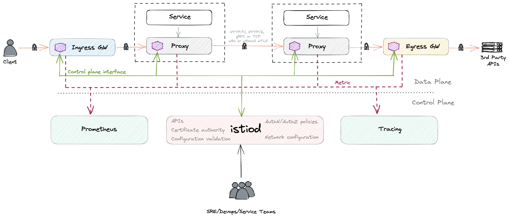
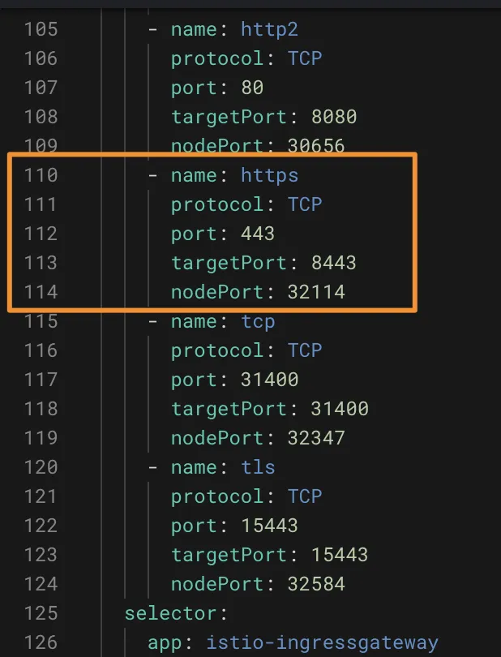
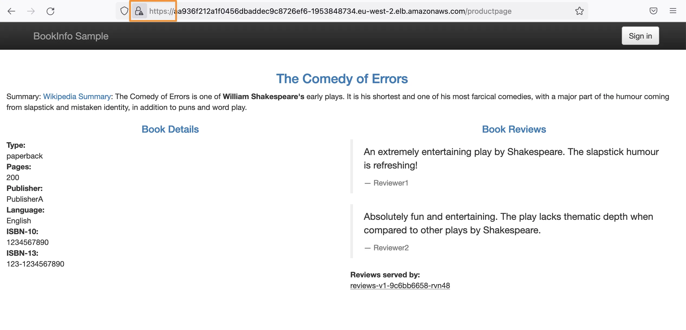

# Secure Your Services with Istio: A Step-by-Step Guide to Setting up Istio TLS Connections

* https://alexandre-vazquez.com/istio-tls-configuration/

## Table of Contents

- [Introduction](https://alexandre-vazquez.com/istio-tls-configuration/#introduction)
- [Scenario View](https://alexandre-vazquez.com/istio-tls-configuration/#scenario-view)
- [How to Expose TLS in Istio?](https://alexandre-vazquez.com/istio-tls-configuration/#how-to-expose-tls-in-istio)
- [How To Consume SSL from Istio?](https://alexandre-vazquez.com/istio-tls-configuration/#how-to-consume-ssl-from-istio)

## Introduction

Istio TLS configuration is one of the essential features when we enable a [Service Mesh](https://alexandre-vazquez.com/tag/service-mesh/). Istio Service Mesh provides so many features to define in a centralized, policy way how transport security, among other characteristics, is handled in the different workloads you have deployed on your Kubernetes cluster.
Istio TLS 配置是我们启用 Service Mesh 时的基本功能之一。
Istio Service Mesh 提供了如此多的功能，可以以集中的策略方式定义如何在 Kubernetes 集群上部署的不同工作负载中处理传输安全性以及其他特性。

One of the main advantages of this approach is that you can have your application focus on the business logic they need to implement. These security aspects can be externalized and centralized without necessarily including an additional effort in each application you have deployed. This is especially relevant if you are following a polyglot approach (as you should) across your Kubernetes cluster workloads.
这种方法的主要优点之一是您可以让应用程序专注于它们需要实现的业务逻辑。
这些安全方面可以外部化和集中化，而无需在您部署的每个应用程序中进行额外的工作。
如果您在 Kubernetes 集群工作负载中遵循多语言方法（正如您应该的那样），这一点尤其重要。

So, this time we’re going to have our applications just handling HTTP traffic for both internal and external, and depending on where we are reaching, we will force that connection to be TLS without the workload needed to be aware of it. So, let’s see how we can enable this Istio TLS configuration
因此，这次我们将让应用程序仅处理内部和外部的 HTTP 流量，并且根据我们到达的位置，我们将强制该连接为 TLS，而无需工作负载意识到这一点。
那么，让我们看看如何启用此 Istio TLS 配置

## Scenario View

We will use this picture you can see below to keep in mind the concepts and components that will interact as part of the different configurations we will apply to this.
我们将使用您在下面看到的这张图片来记住将作为我们将应用于此的不同配置的一部分进行交互的概念和组件。



- We will use the ingress gateway to handle all incoming traffic to the Kubernetes cluster and the egress gateway to handle all outcoming traffic from the cluster.
  我们将使用入口网关来处理 Kubernetes 集群的所有传入流量，并使用出口网关来处理来自集群的所有传出流量。

- We will have a sidecar container deployed in each application to handle the communication from the gateways or the pod-to-pod communication.
  我们将在每个应用程序中部署一个 sidecar 容器来处理来自网关的通信或 Pod 到 Pod 的通信。

To simplify the testing applications, we will use the default sample applications Istio provides, which you can find here.[](https://alexandre-vazquez.com/istio-tls-configuration/# "MISSING LINK")
为了简化测试应用程序，我们将使用 Istio 提供的默认示例应用程序，您可以在此处找到它。

## How to Expose TLS in Istio?
如何在 Istio 中公开 TLS？

This is the easiest part, as all the incoming communication you will receive from the outside will enter the cluster through the Istio Ingress Gateway, so it is this component the one that needs to handle the TLS connection and then use the usual security approach to talk to the pod exposing the logic.
这是最简单的部分，因为您从外部收到的所有传入通信都将通过 Istio Ingress Gateway 进入集群，因此该组件需要处理 TLS 连接，然后使用通常的安全方法进行通信到暴露逻辑的 Pod。

默认情况下，Istio Ingress Gateway 已经公开了 TLS 端口，如下图所示：
By default, the Istio Ingress Gateway already exposes a TLS port, as you can see in the picture below:




So we will need to define a Gateway that receives all this traffic through the HTTPS and redirect that to the pods, and we will do it as you can see here:
因此，我们需要定义一个网关，通过 HTTPS 接收所有这些流量并将其重定向到 Pod，我们将按照您在此处看到的方式进行操作：

```yaml
apiVersion: networking.istio.io/v1alpha3
kind: Gateway
metadata:
  name: bookinfo-gateway-https
  namespace: default
spec:
  selector:
    istio: ingressgateway
  servers:
    - hosts:
        - '*'
      port:
        name: https
        number: 443
        protocol: HTTPS
      tls:
        mode: SIMPLE # enables HTTPS on this port
        credentialName: httpbin-credential
```

As we can see, it is a straightforward configuration, just adding the port HTTPS on the 443 and providing the TLS configuration:
正如我们所看到的，这是一个简单的配置，只需在 443 上添加端口 HTTPS 并提供 TLS 配置：

- We will use a SIMPLE mode, also known as one-way TLS, where only the server is authenticated but not the clients. This is the usual configuration for any web page or web service.
  我们将使用简单模式，也称为单向 TLS，其中仅对服务器进行身份验证，而不对客户端进行身份验证。这是任何网页或 Web 服务的常用配置。

  - We will provide a credentialName that is a TLS secret that has the certificates required to expose and generate the TLS gateway. We used the steps available on the Istio official documentation to create this secret: [Istio / Secure Gateways](https://istio.io/latest/docs/tasks/traffic-management/ingress/secure-ingress/#generate-client-and-server-certificates-and-keys)
    我们将提供一个 credentialName，它是一个 TLS 机密，其中包含公开和生成 TLS 网关所需的证书。 我们使用 Istio 官方文档中提供的步骤来创建此密钥：https://istio.io/latest/docs/tasks/traffic-management/ingress/secure-ingress/#generate-client-and-server-certificates-and-keys

And with that, we can already reach using SSL the same pages:
这样，我们就可以使用 SSL 访问相同的页面：



## How To Consume SSL from Istio?
如何使用 Istio 的 SSL？

Now that we have generated a TLS incoming request without the application knowing anything, we will go one step beyond that and do the most challenging configuration. We will set up TLS/SSL connection to any outgoing communication outside the Kubernetes cluster without the application knowing anything about it.
现在我们已经在应用程序不知道任何情况的情况下生成了 TLS 传入请求，我们将更进一步并进行最具挑战性的配置。
我们将设置与 Kubernetes 集群外部的任何传出通信的 TLS/SSL 连接，而应用程序对此一无所知。

To do so, we will use one of the [Istio concepts we have already covered in a specific article](https://alexandre-vazquez.com/istio-serviceentry/). That concept is the Istio Service Entry that allows us to define an endpoint to manage it inside the MESH.
为此，我们将使用我们在特定文章中已经介绍过的 Istio 概念之一。 这个概念就是 Istio 服务入口，它允许我们定义一个端点来在 MESH 内管理它。

Here we can see the Wikipedia endpoint added to the Service Mesh registry:

```yaml
apiVersion: networking.istio.io/v1beta1
kind: ServiceEntry
metadata:
  name: se-app
  namespace: default
spec:
  hosts:
  - wikipedia.org
  ports:
  - name: https
    number: 443
    protocol: HTTPS
  resolution: DNS
```

Once we have configured the ServiceEntry, we can define a DestinationRule to force all connections to wikipedia.org will use the TLS configuration:

```yaml
apiVersion: networking.istio.io/v1beta1
kind: DestinationRule
metadata:
  name: tls-app
  namespace: default
spec:
  host: wikipedia.org
  trafficPolicy:
    tls:
      mode: SIMPLE
```
